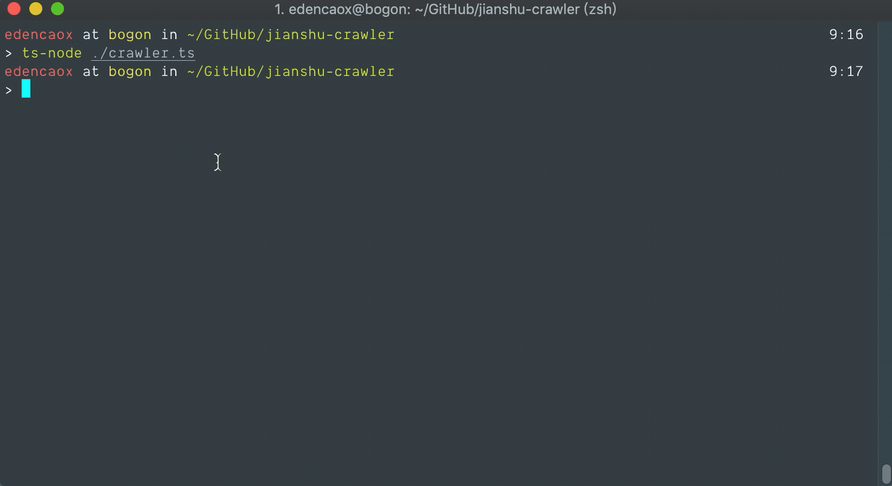
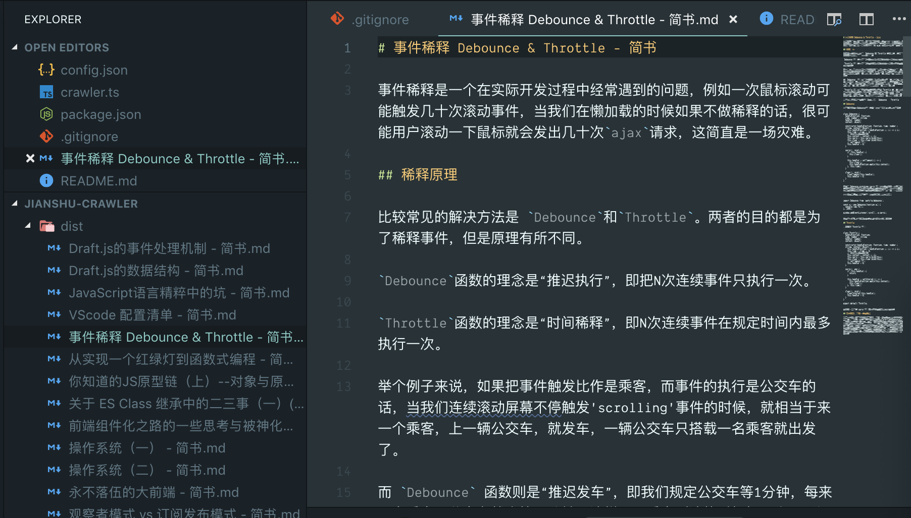

# 简书文章迁移工具
之前一直在简书写文章，现在希望把自己的文章转移到个人博客上面，此爬虫会将所有的个人文章爬下来，转换成 markdown 保存在本地。




## Usage
* node: ^v10.x
* 安装依赖
```sh
yarn install
# or npm i
```
* 在根目录下新建一个 config.json 文件
```sh
jianshu-crawler/
  |- config.json
  |- node_modules/
  |- ...
```
里面需要填写三个字段：
uid: 用户 id


articlePage: 就是当前页面文章页数，鉴于简书是无限滚动所以如果没有其他设置的话一般等于 int(文章数量 / 10) + 1

dist: 就是你希望把下载下来的文章存放的位置，必须是已经存在的目录。就是说如果你选择 ./dist/ 作为目录的话，需要现先在本项目中新建一个 dist/ 目录。
我在项目中提供了一个事例，直接重命名 config.example为config.json就可以了

* 启动项目
```sh
yarn start
# or npm run start
```
